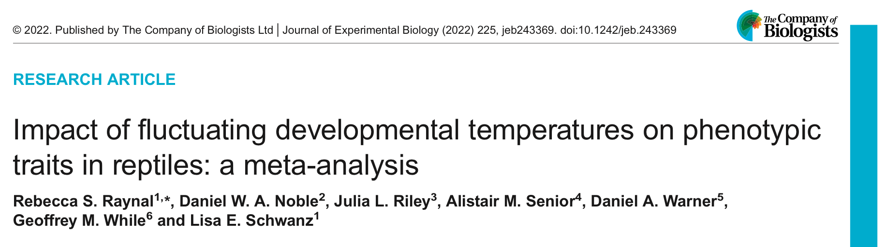

```{r setup, include=FALSE}
knitr::opts_chunk$set(echo = TRUE, cache = FALSE, tidy = TRUE)
options(digits=3)
```

```{r klippy, echo=FALSE, include=TRUE, message=FALSE, warning=FALSE}
#install.packages("devtools")
remotes::install_github("rlesur/klippy")
klippy::klippy(tooltip_message = 'Click to Copy Code', tooltip_success = 'Done', position = 'right', color = "red")

# Load packages
pacman::p_load(metafor, flextable, tidyverse, orchaRd, pander, mathjaxr, equatags, vembedr, magick)

```

## Introduction

We have already introduced the power of [multilevel meta-analytic models](https://daniel1noble.github.io/meta-workshop/multi-level) for dealing with non-independence, such as shared species, [phylogeny](https://daniel1noble.github.io/meta-workshop/phylo) and study [@Noble2017; @NakagawaSantos2012; @Hadfield2010], but meta-analyses often contain even more complex forms on non-independence. 

We might have many effect size estimates from a single study because many traits are measured on the *same sample of organisms*, or many treatments are applied and we can create an *effect size with some common control* [@Noble2017]. This adds complexity to the data set and also results in special types of non-independence that are somewhat unique to meta-analysis -- especially when using contrast-based effect sizes like Hedges' g, log response ratios, log odds ratios etc [@Noble2017]. 

In this tutorial, we'll overview some of these unique forms of non-independence discussing some of the ways that they can be dealt with using different approaches. Often there are no simple solutions because information collected to derive effect sizes are often lacking important details that would allow some forms of dependence to be dealt with. Thankfully, these problems have been thought about for some time by many meta-analysts and there are solutions that work reasonably well [@GleserOlkin2009; @Lajeunesse2011; @Pustejovsky2021; @Tipton2013; @Hedges2010; @Hedges2019]. 

## The Many Forms of Dependence in Meta-analysis

Let's briefly overview why non-independence can be an issue and why simple multilevel meta-analytic models do not always deal with the problem sufficiently well. Recall our MLMA model from the [last tutorial](https://daniel1noble.github.io/meta-workshop/multi-level). 

$$
y_{i} = \mu + s_{j[i]} + spp_{k[i]} + e_{i} + m_{i} \\
m_{i} \sim N(0, v_{i}) \\
s_{j} \sim N(0, \tau^2) \\
spp_{k} \sim N(0, \sigma_{k}^2) \\
e_{i} \sim N(0, \sigma_{e}^2)
$$

We hid some important notation to avoid drawing attention to it initially. The notation we neglected to mention is now included below:

$$
\\
m_{i} \sim N(0, v_{i}\textbf{I}) \\
s_{j} \sim N(0, \tau^2\textbf{I}) \\
spp_{k} \sim N(0, \sigma_{k}^2\textbf{I}) \\
e_{i} \sim N(0, \sigma_{e}^2\textbf{I})
$$
You'll notice that we added in $\bf{I}$, but what is $\bf{I}$? $\bf{I}$ is called the identity matrix. It is a matrix that has rows and columns equal to the number of effect size values (if at the effect level) or the number of species or studies (if at the study or species-level) in the data set. The identity matrix contains 1's on the diagonal and 0's in the off-diagonals. For a data set with 3 effect size estimates the identity matrix looks like this:

$$
\bf{I} = \begin{bmatrix}
1 & 0 & 0 \\
0 & 1 & 0 \\
0 & 0 & 1
\end{bmatrix}
$$
**What is the significance of multiplying the $\bf{I}$ matrix by the variance for each random effect above?** The short story is that we are making the assumption that each random effect added to a given effect size is drawn from an independent and identical distribution. To see why this is the case think about what happens when we multiply $\sigma_{i}^2$ by this matrix. Along the diagonal, we get the exact same variance estimate for every single effect size (or for effect sizes that share a cluster). This tells us that they are sampled from a distribution that has the same mean (0) and variance ($\sigma_{i}^2$) (i.e., are sampled from the same distribution). 

If, however, we multiply the off-diagonals by the variance we get zero. The fact that these off-diagonals are 0 tells us straight away that all the random effects being sampled are independent from one another as otherwise the off-diagonals would be non-zero (i.e., would have a co-variance) (and the correlation matrix would have a correlation above 0). This seems sensible. All effect size estimates from the same study will have the same 'effect' added to the estimate. This indicates that these effects should be more similar to each other by virtue of them being from the same study (Fig. \@ref(fig:fig1)b from @Noble2017). This does, in some sense, deal with non-independence, but not completely!

```{r, fig1, fig.align='center', fig.width= 15, fig.height=15, fig.cap= "Different forms of non-independence described by Noble et al. 2017. A) Effect size estimates could be correlated as a result of shared evolutionary history; B) could be correlated because they come from the same study with the same types of methodology applied. Effect sizes could also be corrrelated because the effects themselves are correlated to differing degrees because of spatial or temporal correlations (E, F), their samling errors are correlated (D) or a combination of both (C)", echo = FALSE}
img1 <- magick::image_read("./figs/nonIn.png")
img1
```

Our assumption would likely be wrong if, for example, we have effect sizes that are measured on different traits of the same animals that vary in their relationship with each other (i.e., some traits are more strongly correlated than others). Alternatively, if our effect size statistics were collected at different times or spatial locations that vary in the extent to which they are correlated with each other. In fact, species themselves vary to different degrees based on how long ago they shared a common ancestor. This is why we include evolutionary relationships among species in our meta-analytic models! (we'll discuss this in the [phylogeny tutorial](https://daniel1noble.github.io/meta-workshop/phylo) [@Hadfield2010; @Chamberlain2012; @NakagawaSantos2012] (Fig. \@ref(fig:fig1)a from @Noble2017). In these cases, we need to properly model the correlation among effect size values induced by these processes.

But, wait, there's more. In fact, things can get very complicated, as outlined by @Noble2017! (See Fig. \@ref(fig:fig1)). If we have used the same data to calculate multiple effect size values then we are also inducing a correlation among their sampling errors [@GleserOlkin2009; @Noble2017; @Lajeunesse2011; @Hedges2019]. That could be a serious problem because the inverse sampling errors are what we are using as [weights in our analysis](https://daniel1noble.github.io/meta-workshop/introduction-to-meta). If there are correlations among sampling errors then we need to account for this in our sampling variance matrix. We can do this but also modifying out sampling error matrix

$$
m_{i} \sim N(0, \textbf{M})
$$

The new sampling variance matrix, $\textbf{M}$, now has the sampling variances along the diagonal, which we know because we can calculate these. But, how do we now know what the covariance between the sampling errors are to be put in the off-diagonals of this $\textbf{M}$ matrix? Luckily there are some approximations for us that we can use to construct the entire $\textbf{M}$ sampling (co)variance matrix [@GleserOlkin2009; @Lajeunesse2011; @Hedges2019]. 


## Why do we want to control for non-independence?   

You might be thinking, so what? Yes, we have all these sources of non-independence, but who cares? Why is it important that we seriously consider the dependency? There are a few reasons:

* First, we want to make sure we get the 'weight' matrix correct so that we get a good estimate of the overall meta-analytic mean
* Second, ignoring the dependency structure will result in much narrower confidence intervals giving us a false impression that we have much greater confidence in the mean estimate than what we actually have.
* Third, and this relates to point 2 above, it will mess up with our inferential statistics. We are more likely to make Type I errors. Narrower standard errors are going to result in larger test statistics and this in combination with our over-inflated degrees of freedom will tell us our results are significant when in fact they are not.

## Example of Dealing with Shared Controls
### Introduction


As an example of how to deal with shared-control non-independence that affects the sampling (co)variance matrix ($\textbf{M}$), we'll turn to a study by [@Raynal2022](https://doi.org/10.1242/jeb.243369). @Raynal2022 were interested in comparing how fluctuating versus constant developmental temperatures (i.e., egg incubation temperatures) impact upon suites of traits. For the purpose of this exercise we will focus on a single trait with the most data, offspring body mass. In other words, we are interested in comparing whether reptiles from fluctuating incubation conditions differ in mass at hatching from reptiles kept at constant incubation conditions. To do this, @Raynal2022 used the log response ratio (*lnRR*) to estimate the magnitude and direction of mass difference between constant and fluctuating temperature treatments. 

Importantly, many studies contained multiple fluctuating temperature treatments. Some studies fluctuated temperatures $\pm$ 2$^{\circ}$C whereas others treatments might have fluctuated temperatures  $\pm$ 8$^{\circ}$C. In this type of study, the constant incubation temperature treatment can be compared with both fluctuating treatments to create two separate effect size values. However, as noted above, this induces a correlation between their sampling errors because the constant treatment is used twice. We'll show you how we can deal with this very common type of situation. 


### Loading the Data and Calculating lnRR

We'll first load the packages and data that we need for the analysis.

```{r, datapack, echo = TRUE, message=FALSE, warning=FALSE, results='hide'}
# Load packages

# install.packages("devtools")  # We need this package to download from GitHub. Un-comment if you don't already have it installed.
  devtools::install_github("daniel1noble/metaAidR")  # We've created a useful function for creating matrices here
    pacman::p_load(metaAidR, metafor, corrplot)

# Load the data
  mass_data <- read.csv("https://raw.githubusercontent.com/daniel1noble/meta-workshop/gh-pages/data/Mass.data.csv")
```

We can now calculate the log response ratio (*lnRR*) from the two treatments within the data:

```{r, echo=TRUE}
## Calculate the log response ratio
mass_data<-escalc(measure = "ROM", n1i = treat_N ,      n2i = control_N , 
                                   m1i = treat_mean ,   m2i = control_mean , 
                                  sd1i = treat_error , sd2i = control_error , data = mass_data)
mass_data$obs <- 1:dim(mass_data)[1]
```

### Creating the $\textbf{M}$ matrix to deal with shared controls

When setting the data up it is important that there is a column indicating which rows share a common control conditions. Rows that have the same value within this column indicate which effects need to have a covariance calculated for the off-diagonal element of the $\textbf{M}$ matrix. In this data set the `comparison_ID` column represents this indicator. 

Once we have a column indicating what effects share a common control we now want to calculate the covariance between the sampling errors for these effects. To do this, we can monopolize of covariance equations for various effect sizes [many large-sample approximations for these can be found in @GleserOlkin2009; and @Lajeunesse2011]. For the log response ratio, @Lajeunesse2011 provides this equation. We won't go over the details, other than to say that it exists and that some of these formulas are already built in to the `make_VCV_matrix` function in the [`metaAidR`](https://github.com/daniel1noble/metaAidR) package. 

```{r, echo=TRUE}
## Calculate the log response ratio
M <- make_VCV_matrix(data = mass_data, V = "vi", 
                               cluster = "comparison_ID", 
                               m = "control_mean", sd = "control_error", n = "control_N", 
                               type = "vcv", vcal = "ROM", obs = "obs")
```

We can see the block structure from the shared controls in the data using `corrplot` (Fig. \@ref(fig:corrplot)). While we present the correlation matrix the actual $\textbf{M}$ matrix has calculated the covariance and stores this in the off-diagonal. This uses @Lajeunesse2011's equation 8, which shows that the covariance is simply the control variance part of the log response ratio sampling variance. 

```{r,corrplot, fig.align='center', fig.cap= " Correlation plot of the M matrix. The (co)variance matrix is converted to a correlation matrix and plotted. We can see the blocked structure in the matrix with off-diagonals indicating the effects sizes that share a common control. In this data there are not a huge number, but enough to see.", echo=TRUE}
## Plot the M matrix as a correlation matrix
corrplot::corrplot(cov2cor(M))
```

### Including the $\textbf{M}$ matrix in our Multi-level Meta-analytic Model

Now that we have constructed the $\textbf{M}$ matrix we are now ready to fit our multi-level meta-analytic model. Note that @Raynal2022 included a phylogenetic correlation matrix in their model, but, we'll save that for the next tutorial and simplify the model. We'll control for study ID, species ID and estimate a residual (within-study) variance:

```{r mlma, echo=TRUE}
#full model including all random effects and moderators to do AICc model selection on
mlma <- rma.mv(yi = yi, V = M, mod = ~ 1, 
                       random = list(~1|paper_no, ~1|Genus_species, ~1|data_ID), 
                       data = mass_data, method = 'REML', test = "t", dfs = "contain")
summary(mlma)
```

As you can see in the model, the `V` argument in `metafor` takes the $\textbf{M}$ matrix directly. This will account for the shared-control usage in the data. This model is a little different than the one actually fit in @Raynal2022 because it does not include phylogeny, but it gives us essentially the same result. 

* **Interpretation**: In essence, what this model is telling us is that there is, on average, a  `r (1 - predict(mlma, transf = exp)$pred)*100`% decrease in mass in the fluctuating temperature treatment compared to the control treatment, which is a pretty trivial difference! We can also see that the 95% confidence intervals are wide and overlap zero indicating that the estimate does not differ significantly from a zero (as indicated by the null hypothesis). Having said that, there is a lot of heterogeneity in effects across species and studies included in the analysis suggesting that it might really depend on the study.

## Robust Variance Estimation -- a useful tool to deal with unknwon dependency

Sometimes we may not be able to deal with all sources of dependency. There are a lot of unknowns with respect to how effect sizes might be correlated, to what extent they are related and it might vary across studies. A very promising tool are **robust variance estimators** which relax the need to known and understand the dependency in your data. [James Pustejovsky](https://www.jepusto.com) provides a fantastic overview of the problem and how robust variance estimators can help counter, and make it easier to deal with, various sources of non-independence. 


```{r, james, echo = FALSE, eval = TRUE}
vembedr::embed_url("https://www.youtube.com/watch?v=sJUc39vneWk") %>% vembedr::use_align("center")
```

We can apply robust variance methods to our model above using the `robust` function in `metafor`. It's reasonably simple.

```{r rve, echo = TRUE}
robust(mlma, cluster = mass_data$paper_no)
```

As we can see here, there are really no changes, which isn't too surprising because we have mostly accounted for all the sources of dependence. In simulations we and others have shown [@Nakagawa2021; @Song2021; @Pustejovsky2021; @Tipton2013] RVE's do a very good job.

## Conclusions

There are a tonne of different sources of non-independence you might encounter in meta-analysis -- some of these are somewhat unique [@Noble2017]. In the next tutorial we'll talk about another common source -- phylogeny. Unfortunately, we don't have time (or enough examples) to overview the different types and how to deal with them all. In some cases, it may not really matter whether all sources are correctly dealt with in the model, and it can get quite complex such that it may not be possible to deal with them all anyway. Having said that, @Noble2017 recommend: 1) reporting on the different sources of non-independence explicitly and 2) conducting sensitivity analyses that explore the impacts of non-independence on inferences. The use of robust variance estimators shows immense promise in dealing with a multitude of dependency within a data set without having to specify it all explicitly [@Pustejovsky2021; @Tipton2013; @Hedges2010; @Hedges2019; @Nakagawa2021; @Song2021]

## References

<div id="refs"></div>
<br>

## Session Information

```{r sessioninfo, echo = FALSE}
pander(sessionInfo(), locale = FALSE)
```

## [Back to Table of Contents](https://daniel1noble.github.io/meta-workshop/) {.hide}

<div class="tocify-extend-page" data-unique="tocify-extend-page" style="height: 0;"></div>
