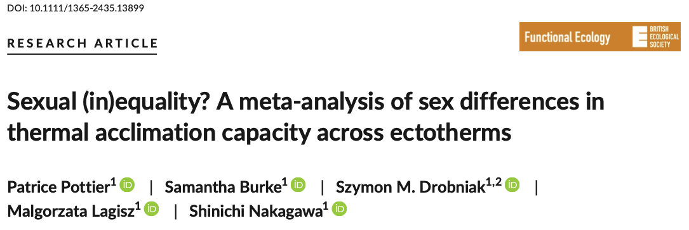

```{r setup, include=FALSE}
knitr::opts_chunk$set(echo = TRUE, cache = FALSE, tidy = TRUE)
options(digits=3)
```

```{r klippy, echo=FALSE, include=TRUE, message=FALSE, warning=FALSE}
#install.packages("devtools")
remotes::install_github("rlesur/klippy")
klippy::klippy(tooltip_message = 'Click to Copy Code', tooltip_success = 'Done', position = 'right', color = "red")

# Load packages
pacman::p_load(metafor, flextable, tidyverse, orchaRd, pander, mathjaxr, equatags, vembedr, magick)

```

## **Introduction to Heterogeneity in Meta-analysis**

In physiology, ecology and evolution, we deal with many different populations, species, experimental designs etc. As such, we're not just interested in understanding 'what the overall effect' actually is (in fact, we may not even care in many cases), but we are mainly focused on attempting to understand what factors (e.g., biological, methodological) explain variation in effects [@Noble2022; @Lag2010; @Gurevitch2018]. Understanding and quantifying how much variability in effects exist, whether this is more than what we expect by chance, and what factors explain variation is a primary goal of meta-analysis. 

Meta-analytic mean estimates need to be interpreted in the context of how much variation in effects exist within and across studies. As such, reporting upon measures of variability, or what is referred to as 'heterogeneity' in meta-analysis, is essential to meta-analysis and should never be ignored (even though it often is unfortunately) [@ODea2021; @NakagawaSantos2012; @Borenstein2019; @Nakagawa2017; @Gurevitch2018]. 

There are a number of important metrics of heterogeneity that are commonly used and reported upon in the meta-analytic literature [@NakagawaSantos2012; @Borenstein2019; @Nakagawa2017]. We'll overview in this tutorial how to calculate, and interpret, many of the common types and what they mean with respect to interpreting the meta-analytic mean. Understanding the consistency of results across studies tells one a great deal about how likely an effect is going to be picked up in future studies and whether we can make broad general conclusions. 

## **Measures of Heterogeneity**

The most commonly encountered measures of heterogeneity in comparative physiology, and indeed ecology and evolution more generally, are results of *Q* tests,  $I^2$ metrics (or  raw $\tau^2$ or variance estimates), and less commonly, prediction intervals. These measures of heterogeneity (even if just a few) should always be presented along side meta-analytic mean effect size estimates because they tell the reader a great deal about the 'consistency' of results (e.g., prediction intervals, total heterogeneity) or the relative contribution of different factors to effect size variation (i.e., different measures of $I^2$). We'll overview these different metrics and show how to calculate an interpret them in meta-analyses. 

For the purpose of this tutorial we'll assume the following multilevel meta-analytic model is fit as described in the [multilevel model tutorial](https://daniel1noble.github.io/meta-workshop/multi-level). If you can't quite remember all the notation we recommend going back to review that page.  

$$
y_{i} = \mu + s_{j[i]} + spp_{k[i]} + e_{i} + m_{i} \\
m_{i} \sim N(0, v_{i}) \\
s_{j} \sim N(0, \tau^2) \\
spp_{k} \sim N(0, \sigma_{k}^2) \\
e_{i} \sim N(0, \sigma_{e}^2)
$$
We will return to the meta-analysis by @Pottier2021 that we already detailed in the [multilevel meta-analysis tutorial](https://daniel1noble.github.io/meta-workshop/multi-level). We'll walk through the different types of heterogeneity statistics that we can calculate for the model. 



We can re-load that data again and get it ready for analysis using the code below:

```{r}
# install.packages("pacman") ; uncomment this line if you haven't already installed 'pacman'
pacman::p_load(metafor, tidyverse)

asr_dat <- read.csv("https://osf.io/qn2af/download")

#' @title arr
#' @description Calculates the acclimation response ratio (ARR).  
#' @param t2_l  Lowest of the two treatment temperatures
#' @param t1_h  Highest of the two treatment temperatures
#' @param x1_h  Mean trait value at high temperature
#' @param x2_l  Mean trait value at low temperature
#' @param sd1_h Standard deviation of mean trait value at high temperature
#' @param sd2_l Standard deviation of mean trait value at low temperature
#' @param n1_h  Sample size at high temperature
#' @param n2_l  Sample size at low temperature

arr <- function(x1_h, x2_l, sd1_h, sd2_l, n1_h, n2_l, t1_h, t2_l){
        ARR <- (x1_h - x2_l)/(t1_h - t2_l)
      V_ARR <- ((1/(t1_h - t2_l))^2*(sd2_l^2/n2_l + sd1_h^2/n1_h))
return(data.frame(ARR, V_ARR))
}

# Calculate the effect sizes
asr_dat<-asr_dat %>% 
              mutate(ARR= arr(x1_h = mean_high, x2_l = mean_low, t1_h = acc_temp_high, t2_l = acc_temp_low, 
                              sd1_h = sd_high, sd2_l = sd_low, n1_h = n_high_adj, n2_l = n_low_adj)[,1], 
                     V_ARR = arr(x1_h =  mean_high, x2_l = mean_low, t1_h = acc_temp_high, t2_l = acc_temp_low, 
                           sd1_h = sd_high, sd2_l = sd_low, n1_h = n_high_adj, n2_l = n_low_adj)[,2]) %>% 
                filter(sex == "female")

# Re-fit the multilevel meta-analytic model
MLMA <- metafor::rma.mv(yi= ARR~ 1, V = V_ARR, 
                   method="REML",
                   random=list(~1|species_ID,
                               ~1|study_ID,
                               ~1|es_ID), 
                   dfs = "contain",
                   test="t",
                   data=asr_dat)
```

We'll now use this model to calculate various heterogeneity statistics in addition to the ones already calculated (which we will describe below). 

### Proportion of Total Heterogeneity: $I_{total}^2$

$I^2$ estimates are probably most commonly presented in the literature [@Higgins2003; @Higgins2002; @Nakagawa2017; @Senior2016; @Borenstein2019]. There are different forms of $I^2$ that can be calculated, but the one that describes the proportion of effect size variation after accounting for total sampling variation is $I_{total}^2$ [@NakagawaSantos2012]. Assuming we're using our multilevel model described above, it's calculated as follows:

$$ 
\begin{equation} 
I^2_{total} = \frac{\sigma^2_{study} + \sigma^2_{phylogeny} + \sigma^2_{species} + \sigma^2_{residual}}{\sigma^2_{study} + \sigma^2_{phylogeny} + \sigma^2_{species} + \sigma^2_{residual} +\sigma^2_{m}} \
(\#eq:itot)
\end{equation} 
$$

where $\sigma^2_{total} = \sigma^2_{study} + \sigma^2_{phylogeny} + \sigma^2_{species} + \sigma^2_{residual} +\sigma^2_{m}$ is the total effect size variance and $\sigma^2_{m}$ is the 'typical' sampling error variance calculated as:

$$
\begin{equation} 
\sigma_{m}^2 = \sum w_{i}\left( k-1\right) / \left[ \left( \sum w_{i}\right)^2  + \sum w_{i}^2\right] \
(\#eq:w)
\end{equation} 
$$

where *k* is the number of studies and the weights, $w_{i} = \frac{1}{v_{i}}$, can be calculated using the inverse of the sampling variance ($v_{i}$) for each effect size, *i*. Below, we'll make use of the `orchaRd` R package [[vers. 2.0](https://github.com/daniel1noble/orchaRd); @Nakagawa2021c] to calculate various $I^2$ metrics. In fact, we can simply change what is in the numerator of eqn \@ref(eq:itot) to calculate a multitude of different $I^2$ metrics that can be useful in understanding the relative importance of factors most important in explaining effect size variation. We'll do this below:

```{r i2, echo=TRUE}
# The orchaRd package has some convenient functions for calculating various I2 estimates including total. We'll load and install that package
#install.packages("pacman")
pacman::p_load(devtools, tidyverse, metafor, patchwork, R.rsp, emmeans, flextable)

#devtools::install_github("daniel1noble/orchaRd", force = TRUE, build_vignettes = TRUE)
library(orchaRd)

orchaRd::i2_ml(MLMA, data = asr_dat)

```

#### Interpreting $I^2$ Estimates {.tabset .tabset-fade .tabset-pills} 

##### First Task! {.tabset .tabset-fade .tabset-pills} 

**Interpret the meaning of $I_{Total}^2$ from the multilevel meta-analytic model**

<br>

##### First Answer! {.tabset .tabset-fade .tabset-pills} 

Overall, we have highly heterogeneous effect size data because sampling variation only contributes to `r 100-orchaRd::i2_ml(MLMA, data = asr_dat)[1]`% of the total variation in effects.  

<br>

##### Second Task! {.tabset .tabset-fade .tabset-pills} 

**Interpret the meaning of $I_{study}^2$ from the multilevel meta-analytic model**

<br>

##### Second Answer! {.tabset .tabset-fade .tabset-pills} 

From the multilevel meta-analytic model we find that `r orchaRd::i2_ml(MLMA, data = asr_dat)[3]`%  of the total variation in effect size estimates is the result of differences between studies.

<br>


#### Bootstrapping $I^2$ Estimates
There are also times that we may want to estimate, and present, uncertainty about these heterogeneity estimates. We can do that by bootstrapping 1000 times:

```{r i2boot, echo=TRUE}
# The orchaRd package has some convenient functions for calculating various I2 estimates including total. We'll load and install that package
#install.packages("pacman")
pacman::p_load(devtools, tidyverse, metafor, patchwork, R.rsp, emmeans, flextable)

#devtools::install_github("daniel1noble/orchaRd", force = TRUE, build_vignettes = TRUE)
library(orchaRd)

orchaRd::i2_ml(MLMA, data = asr_dat, boot = 1000)

```

Here, we can now see that $I_{total}^2$ has a fairly narrow 95% confidence interval of ~ 0.97 to 0.99.

### Prediction Intervals

Prediction intervals (PI) are probably the best and most intuitive way to report heterogeneity of meta-analytic results [@Borenstein2019; @Noble2022; @Nakagawa2021c]. Predictions intervals tell us how much we can expect a given effect size to vary across studies. More specifically, if we were to go out and conduct another study or experiment they tell us what the range of effect size estimates we are expected to observe 95% of the time from that new study [@Borenstein2019; @Noble2022; @Nakagawa2021c]. 

Prediction intervals can be calculated in a similar way to confidence intervals but instead of just using the standard error, like we do with confidence interval construction we add in the extra random effect variance estimates. For our model above, PI can be calculated as follows:

$$ 
\begin{equation} 
PI \sim  \bar{u} \pm 1.96 \sqrt{SE^2 + \sigma^2_{study} +  \sigma^2_{species} + \sigma^2_{residual}}
(\#eq:pi)
\end{equation} 
$$

We can get these quite easily using the `predict` function in `metafor`:

```{r pis, echo=TRUE}
# Calculate the prediction intervals
predict(MLMA)
```

#### Interpreting Predcition Intervals {.tabset .tabset-fade .tabset-pills}

##### Task! {.tabset .tabset-fade .tabset-pills}

**If the meta-analytic mean ARR is `r predict(MLMA)[[1]]` what would be the expected range of effect size we would expect in a future study? Are the studies consistent or inconsistent?**

<br> 

##### Answer! {.tabset .tabset-fade .tabset-pills}

Our 95% prediction intervals are wide. Effect sizes (ARR) we are expected to get range from `r predict(MLMA)[[5]]` to `r predict(MLMA)[[6]]`, suggesting a lot of inconsistency between studies. 

<br>

### *Q*-tests: Inferential Tests to Determine Excess Heterogeneity 

So far we've talked about important heterogeneity statistics that describe, and quantify, the proportion of variability ($I^2$) or the expected range of plausible effect size values which incorporate all the variance estimates (PI). But, how do we know that the heterogeneity in the data is greater than what we would expect by chance? It seems obvious that, if the $I_{total}^2$ is really high (i.e., >85%) there's a lot of variability in effects within and across studies. While these statistics are probably sufficient, *Q* tests can also be useful to more formally be able to make an inferential statement about whether heterogeneity is significantly greater than chance. 

We have already encountered how to calculate the *Q*-statistic when discussing [fixed and random effects](https://daniel1noble.github.io/meta-workshop/fixed-vs-random) models. We can use the *Q* statistic now to compare this against a $\chi^2$-distribution to calculate a p-value. [Wolfgang's documentation](https://wviechtb.github.io/metafor/reference/rma.mv.html) (`?rma.mv`) describes what the *Q*-test means:

> Cochran's 𝑄-test, which tests whether the variability in the observed effect sizes or outcomes is larger than one would expect based on sampling variability (and the given covariances among the sampling errors) alone. A significant test suggests that the true effects/outcomes are heterogeneous. 

<br> 
We don't need to do anything special to get this test. In fact, this is automatically done by `metafor`:

```{r, q, echo=TRUE}
print(MLMA)
```

#### Describing the *Q*-test  {.tabset .tabset-fade .tabset-pills} 

##### Task! {.tabset .tabset-fade .tabset-pills} 

**How would you describe in a paper the *Q*-test from the `metafor` model above?**

<br>

##### Answer! {.tabset .tabset-fade .tabset-pills} 

Of course, there are a multitude of ways that we could describe this test in words, but one way to describe it in your results section might be as follows:

> The overall mean ARR across ectotherms was `r MLMA$b` and differed significantly from zero (95% CI: `r MLMA$ci.lb` to `r MLMA$ci.ub`, df = `r MLMA$ddf`, t = `r MLMA$b / MLMA$se`, p < 0.001). However, there was significant residual heterogeneity (*Q* = `r MLMA$QE`, df = `r dim(MLMA$data)[1]-1`, p < 0.001) with estimates expected to range from `r predict(MLMA)[[5]]` to `r predict(MLMA)[[6]]` (95% Prediction Interval).

<br>

### Proportion of Variation Explained by the Model: $R^2_{marginal}$ and $R^2_{conditional}$

You will probably have noticed that $I^2$ looks awfully familiar. It looks a lot like the way we might calculate $R^2$ described by @NakagawaSchielzeth2013. Well, you would be correct! Often we also want to quantify how much variation is explained by our moderators and random effects in our multilevel meta-regression model [@Nakagawa2017ab; @NakagawaSchielzeth2013]. This is done using $R^2$. We can calculate different $R^2$ values depending on whether we ignore or include random effects in the numerator. If only the variation explained by moderators is included in the numerator than we call this $R_{marginal}^2$, which is defined as:

$$
\begin{equation} 
R^2_{marginal} = \frac{\sigma^2_{fixed}}{\sigma^2_{fixed} + \sigma^2_{study} + \sigma^2_{phylogeny} + \sigma^2_{species} + \sigma^2_{residual}} \
(\#eq:r2)
\end{equation} 
$$

Note that this formula does not include $\sigma^2_{m}$ as sampling error variance is assumed to be known in meta-analysis. We won't go into the details on how to calculate and interpret these because we'll cover this in a later tutorial on [publication bias](https://daniel1noble.github.io/meta-workshop/pub-bias1). Suffice it to say that this is a useful statistic from describing how much variation your moderators or model explain.

## **Conclusion**

Hopefully it's clear from this tutorial why explicitly estimating and reporting upon heterogeneity is so critically important in meta-analysis. Of course, some of these measures are only possible if we known the total sampling variance, which is not possible if one doesn't use a weighted meta-analytic model. While all heterogeneity measures are useful, we agree with @Borenstein2019 and @Nakagawa2021c that prediction intervals are probably the best to present given they are a very intuitive interpretation of heterogeneity. 

## **References**

<div id="refs"></div>
<br> 

## **Session Information**

```{r sessioninfo, echo = FALSE}
pander(sessionInfo(), locale = FALSE)
```

## [Back to Table of Contents](https://daniel1noble.github.io/meta-workshop/) {.hide}

<div class="tocify-extend-page" data-unique="tocify-extend-page" style="height: 0;"></div>
