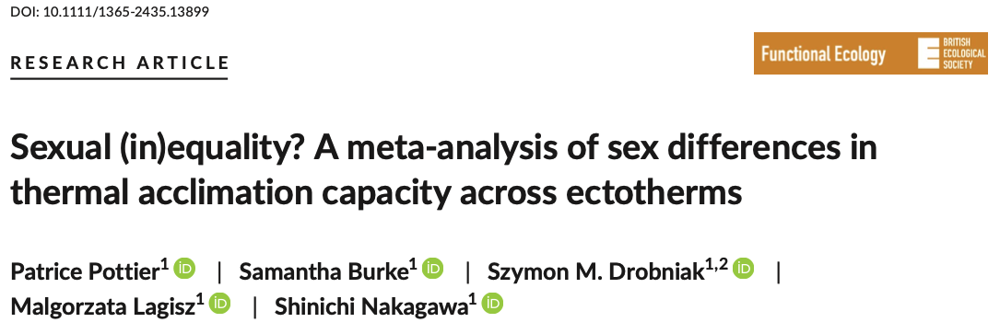

```{r setup, include=FALSE}
knitr::opts_chunk$set(echo = TRUE, cache = FALSE, tidy = TRUE)
options(digits=3)
```

```{r klippy, echo=FALSE, include=TRUE, message=FALSE, warning=FALSE}
#install.packages("devtools")
remotes::install_github("rlesur/klippy")
klippy::klippy(tooltip_message = 'Click to Copy Code', tooltip_success = 'Done', position = 'right', color = "red")

# Load packages
pacman::p_load(metafor, flextable, tidyverse, orchaRd, pander, mathjaxr, equatags, vembedr, magick)

# To use mathjaxr 
```

## **Introduction to Multi-level Meta-analysis**

Ecological and evolutionary meta-analysis more often than not need much more sophisticated multilevel meta-analytic models [@NakagawaSantos2012; @Hadfield2010; @Noble2017] compared with [random effect models](https://daniel1noble.github.io/meta-workshop/fixed-vs-random) to analyse data. Biological data from field and lab-based experiments are highly structured -- many studies could be done on the same species or they could be done by the same lab group or student sharing similar methodology [@Noble2017; @NakagawaSantos2012]. In addition, we might have many effect size estimates from a single study because many traits are measured, or many treatments are applied [@Noble2017]. This adds complexity to the data set and also results in special types of non-independence that are somewhat unique to meta-analysis -- especially when using contrast-based effect sizes like Hedges' g, log response ratios, log odds ratios etc [@Noble2017]. 

In the past, complex non-independence was often dealt with by: 1) conducting separate meta-analyses on subsets of non-independent data sets, usually using random effect models; 2) taking one or only a subset of effect size estimates from a single study to reduce non-independence; and/or 3) averaging effect size estimates from a single study and modelling the average [@NakagawaSantos2012]. These approaches can be problematic because disposing of useful effect size data will result in a loss of statistical power or even inflated Type I error rates if average effect size estimates were not calculated accounting for non-independence [@Nakagawa2021]. Furthermore, removing effect size estimates from an analysis prevents estimation of biological and methodologically relevant information that can help shape the field [@NakagawaSantos2012; @Nakagawa2021]. While the above approaches could still be useful at times, where possible, we recommend you model all available data [@Nakagawa2021; @Noble2017; @NakagawaSantos2012].

In the next series of tutorials we'll overview multilevel meta-analytic models and discuss common forms of non-independence and how to deal with these challenges. Here, we'll first focus on simple multilevel meta-analysis models and how to interpret these. We'll then work our way up to including more complex forms of non-independence, such as phylogenetic meta-analysis and accounting for shared control. Technically, all these sources could be built into a single model but will require a substantial amount of data. Sometimes it will not be possible to deal with all sources of non-independence, in which case it's important to conduct sensitivity analyses to understand how your conclusions and inferences are affected by the analytic decisions made [@Noble2017]. Strong justification for your choices is always essential.

## **Simple Multilevel Meta-analytic Model**

[Recall](https://daniel1noble.github.io/meta-workshop/fixed-vs-random) that a random effects model is defined as follows: 

$$
y_{i} = \mu + s_{i} + m_{i} \\
m_{i} \sim N(0, v_{i}) \\
s_{i} \sim N(0, \tau^2)
$$
In this model, $y_{i}$ is the *i*th effect size estimate and $m_{i}$ is the sampling error (deviation from $\mu$) for effect size *i*. Given that we have a single effect size estimate from each study we can include $s_{i}$, which is the study specific deviation, and this gives us an ability to estimate a "residual" variance from this model. That's because after we remove the known sampling variance there is likely to be "extra" variability among effect sizes at the effect/study level (in this case these are confounded because we have one effect / study). We can estimate that explicitly which is what we are doing here. The challenge with having a single effect estimate per study is that the within and between study variances are confounded. In other words, we cannot estimate both. 

More commonly, we can extract many (sometimes a lot) effect size estimates from a single study. In such case, we no longer have a single effect size estimate from a given study but a whole bunch of effects from a single study. These could be effects from different experimental treatments, at different time points or on different traits. These effects are not independent of each other and there is likely a substantial amount of within study variation in addition to the across study variation [@NakagawaSantos2012]. We can now estimate these two sources of variability explicitly turning our model into what is the simplest form of a multilevel meta-analytic model: 

$$
y_{i,j} = \mu + s_{j} + e_{i,j} + m_{i,j} \\
m_{i,j} \sim N(0, v_{i,j}) \\
s_{j} \sim N(0, \tau^2) \\
e_{i,j} \sim N(0, \sigma_{e}^2)
$$

You'll notice that the notation changes slightly -- $y_{i,j}$ is now the *i* effect size from study *j* and $m_{i,j}$ is effect size *i*'s known sampling variance from study *j*. $s_{j}$ is now the study specific effect, *j*, applied to the *i*th effect size, where *j* = 1,...,$N_{studies}$. We have also now added a random effect ($e_{i,j}$) to the model. $e_{i,j}$ is the effect-size-specific (within study) effect. This is often referred to as a 'residual' effect [@NakagawaSantos2012] and is used to estimate a residual variance. 

## **Building more Complex Multilevel Meta-analytic Models**

In reality, we may also have lots of studies on a specific set of species. For example, common or economically important species, like Salmon, Trout or lab model organisms like Zebrafish might be over-represented in the data set. This adds an additional level of structure to our data. We can account for species in this model by adding another random effect that captures the similarities between effect size estimates from the same species. As such, we can expand our multilevel model as follows:

$$
y_{i,j,k} = \mu + s_{j} + spp_{k} + e_{i,j,k} + m_{i,j,k} \\
m_{i,j,k} \sim N(0, v_{i,j}) \\
s_{j} \sim N(0, \tau^2) \\
s_{k} \sim N(0, \sigma_{k}^2) \\
e_{i,j,k} \sim N(0, \sigma_{e}^2)
$$

Here, $y_{i,j, k}$ is now the *i*th effect size from study *j* and species *k*. $m_{i,j, k}$ is effect size *i*'s known sampling variance from study *j* and species *k*. $e_{i,j, k}$ is the effect-size-specific (within study) applied to each effect *i* from study *j* and species *k*. $s_{j}$ is still the study specific effect, *j*, applied to the *i*th effect size, where *j* = 1,...,$N_{studies}$, but now $spp_{k}$ is the species specific effect, *k*, applied to the *i*th effect size, where *k* = 1,...,$N_{species}$. 

As you can imagine, the notation can get quite complicated the more levels you add. As such, a simplification of the above model notation that you might read [e.g., @NakagawaSantos2012; @Noble2017] is as follows:

$$
y_{i} = \mu + s_{j[i]} + spp_{k[i]} + e_{i} + m_{i} \\
m_{i} \sim N(0, v_{i}) \\
s_{j} \sim N(0, \tau^2) \\
s_{k} \sim N(0, \sigma_{k}^2) \\
e_{i} \sim N(0, \sigma_{e}^2)
$$

## **Fitting a Multi-level Meta-analytic Model**



To demonstrate how to fit a multilevel meta-analytic model similar to the one discussed above we'll turn to a [familiar example](https://daniel1noble.github.io/meta-workshop/nuis-het) by @Pottier2021, who used the acclimation response ratio (ARR) to analyse thermal acclimation responses on $CT_{max}$ and how this differs between the sexes. We'll keep it simple for the moment and focus exclusively on a single sex. 

### Download Data and Functions for $ARR$

We'll download the raw data from the paper again. We'll also need to load the `metafor` package to fit our models and the tidyverse package for processing the data.

```{r}
# install.packages("pacman") ; uncomment this line if you haven't already installed 'pacman'
pacman::p_load(metafor, tidyverse)

asr_dat <- read.csv("https://osf.io/qn2af/download")
```

We'll also need our function for calculating ARR and its sampling variance because these don't exist in any current packages. 

```{r ARRfunc}
#' @title arr
#' @description Calculates the acclimation response ratio (ARR).  
#' @param t2_l  Lowest of the two treatment temperatures
#' @param t1_h  Highest of the two treatment temperatures
#' @param x1_h  Mean trait value at high temperature
#' @param x2_l  Mean trait value at low temperature
#' @param sd1_h Standard deviation of mean trait value at high temperature
#' @param sd2_l Standard deviation of mean trait value at low temperature
#' @param n1_h  Sample size at high temperature
#' @param n2_l  Sample size at low temperature

arr <- function(x1_h, x2_l, sd1_h, sd2_l, n1_h, n2_l, t1_h, t2_l){
        ARR <- (x1_h - x2_l)/(t1_h - t2_l)
      V_ARR <- ((1/(t1_h - t2_l))^2*(sd2_l^2/n2_l + sd1_h^2/n1_h))
return(data.frame(ARR, V_ARR))
}
```


### Calculating $ARR$ and It's Sampling Variance
Using the `arr` function above we can now calculate the acclimation response ratio (ARR). Given @Pottier2021 were interested in comparing the sexes, they calculated the ARR difference between males and females. To simplify here, we'll just focus on estimating the ARR for a single sex, females. As such, we'll calculate our ARR effect size and sampling variance and then sub-set out the data on females.

```{r, tidy=TRUE}
# Calculate the effect sizes
asr_dat<-asr_dat %>% 
              mutate(ARR= arr(x1_h = mean_high, x2_l = mean_low, t1_h = acc_temp_high, t2_l = acc_temp_low, 
                              sd1_h = sd_high, sd2_l = sd_low, n1_h = n_high_adj, n2_l = n_low_adj)[,1], 
                     V_ARR = arr(x1_h =  mean_high, x2_l = mean_low, t1_h = acc_temp_high, t2_l = acc_temp_low, 
                           sd1_h = sd_high, sd2_l = sd_low, n1_h = n_high_adj, n2_l = n_low_adj)[,2]) %>% 
                filter(sex == "female")
```

### Fitting a Multilevel Meta-analytic Model in `metafor`

Our data is now ready for analysis! We will use the `rma.mv` function in `metafor` to fit our first multilevel meta-analysis model. The model takes the ARR as a response variable (`yi`) and accounts for it's sampling variance (`V` = V_ARR). We are also going to estimate a random effect variance for species, between study and within-study grouping variables to control for non-independence and understand sources driving effect size variability. These are all denoted in the `random` argument of `metafor` which takes a list of all the random effects. 

You will notice two additional arguments being specified: 

* The first, `dfs`, which calculates the degrees of freedom for the inferential tests in the model. `dfs = "contain"` will calculate the degrees of freedom based on the lowest clustering level minus 1 (in this case study). Simulations have shown that this is a more robust measure to protect against type I errors [@Nakagawa2021]. 

* The second argument, `test` specifies the test statistic used. `metafor` defaults to z values based on the standard normal distribution, however, simulations have shown [@Pappalardo2021] and it has been recommended [@Rosenberg2013b], that the t-distribution be used because samples sizes are often small and the true variance of the test is being estimated. 

```{r, class.source='klippy'}

# Multi-level meta-analytic model
MLMA <- metafor::rma.mv(yi= ARR~ 1, V = V_ARR, 
                   method="REML",
                   random=list(~1|species_ID,
                               ~1|study_ID,
                               ~1|es_ID), 
                   dfs = "contain",
                   test="t",
                   data=asr_dat)
print(MLMA)

```

#### What does the model output tell us? {.tabset .tabset-fade .tabset-pills} 

##### Task {.tabset .tabset-fade .tabset-pills} 
**What is the overall mean estimate and variance of the model, and how much heterogeneity exist?** 

##### Answer {.tabset .tabset-fade .tabset-pills} 
We can see from above that the model estimates an **overall meta-analytic mean as `r MLMA$b` with a 95% confidence interval of `r MLMA$ci.lb` to `r MLMA$ci.ub`**. **In other words, for each degree variation in acclimation temperature female heat tolerance changes by an average of `r MLMA$b`$^{\circ}$C**. 

We can also see that there's a significant amount of heterogeneity among our effect size estimates with our *Q*-test being significant. Some of this heterogeneity seems to be driven by variation among studies, within studies and among species as judged by the variance components of the model. We'll probe how to dissect and discuss this heterogeneity in later tutorials. 

## **References**

<div id="refs"></div>

<br>

## **Session Information**

```{r sessioninfo, echo = FALSE}
pander(sessionInfo(), locale = FALSE)
```

## [Back to Table of Contents](https://daniel1noble.github.io/meta-workshop/) {.hide}

<div class="tocify-extend-page" data-unique="tocify-extend-page" style="height: 0;"></div>
