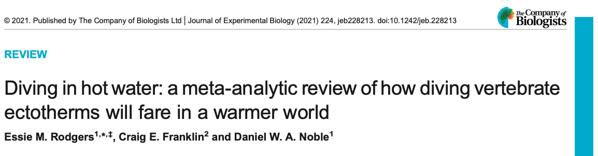

```{r setup, include=FALSE}
knitr::opts_chunk$set(echo = TRUE, cache = FALSE, tidy = TRUE)
options(digits=2)
```

```{r klippy, echo=FALSE, include=TRUE, message=FALSE, warning=FALSE}
#install.packages("devtools")
remotes::install_github("rlesur/klippy")
klippy::klippy(tooltip_message = 'Click to Copy Code', tooltip_success = 'Done', position = 'right', color = "red")
```

## **Introduction**

In the [previous tutorial](https://daniel1noble.github.io/meta-workshop/effect-size) we over-viewed a few of the common effect size statistics likely to be used in comparative physiology. However, studies can vary in ways that can make the interpretation of these statistics challenging.  

**Nuisance heterogeneity** -- factors causing variation in effects that are blatantly obvious, like temperature and dosage differences applied across studies -- are common in studies used in comparative physiology meta-analyses [@Noble2022; @Borenstein2019]. **Nuisance heterogeneity can be a big driver of effect size magnitude**. For example, a contrast-based effect size, such as log response ratio, calculated from a study that has manipulated treatments to have a 10$^{\circ}$C temperature difference between treatments is likely going to give you a much larger effect size than a study that manipulated a treatment temperature difference of 2$^{\circ}$C. Amalgamating such effects within a meta-analysis will make the interpretation of effect magnitude complicated because it's difficult to know what magnitude of, say temperature, our effect size should be interpreted over. 

There are a few different ways to deal with nuisance heterogeneity. The most common approach is to simply **include a moderator in a meta-regression model that controls for the temperature difference between treatments** [@Noble2022]. You can re-scale this continuous moderator (center the variable on the mean so '0' equates to the average difference) so that intercepts can be interpreted more easily [@Noble2022]. Alternatively, we can 'correct' our effect sizes to account for the nuisance variable. In this tutorial, we'll overview the latter approach as it can simplify modelling.

## **Effect Sizes Corrected for Nuisance Heterogeneity**

### **Temperature Coefficient, $Q_{10}$**
One common and well known effect size that is used in comparative physiology is the [temperature coefficient, $Q_{10}$](https://en.wikipedia.org/wiki/Q10_(temperature_coefficient)). As [discussed](https://daniel1noble.github.io/meta-workshop/effect-size), effect sizes need to be: 1) comparable across studies and 2) we need to know, or be able to approximate, the sampling variance in order to make use of meta-analytic models. While $Q_{10}$ satisfies 1) we do now know what the sampling variance should be for this effect size. @Noble2022 fixes that issue by deriving it's sampling variance. 

To begin, recall that $Q_{10}$, is defined as: 


$$
\begin{equation} 
  Q_{10} = \left( \frac{R_{2}}{R_{1}} \right)^{ \left(\ \frac{10^{\circ}C}{T_{2}-T_{1}} \right) }
  (\#eq:q10)
\end{equation} 
$$ 

Here, $R_{1}$ and $R_{2}$ are mean physiological rates and $T_{1}$ and $T_{2}$ are the temperatures that these rates are measured. Natural log transformation of equation \@ref(eq:q10) leads to the following log transformed $Q_{10}$:

$$
\begin{equation} 
  lnRR_{Q_{10}} = ln\left( \frac{R_{2}}{R_{1}} \right){ \left(\ \frac{10^{\circ}C}{T_{2}-T_{1}} \right) }
(\#eq:lnq10)
\end{equation} 
$$ 

@Noble2022 call this transformed effect size $LnRR_{Q_{10}}$ because of its similarities with the log response ratio. Equation \@ref(eq:lnq10) is essentially a temperature-corrected equivalent of *lnRR* when the numerator and denominator are measured at different temperatures. $lnRR_{Q_{10}}$ is more likely to satisfy the assumption of residual normality than $Q_{10}$ and given it's similarities to *lnRR* we can now approximate it's sampling variance [see @Hedges1999]. The recognition of this equivalence means that we can calculate the sampling variance for equation \@ref(eq:lnq10) as follows:

$$
\begin{equation} 
  s^2_{lnRR_{Q_{10}}} = \left( \frac{SD_{2}^2}{R^2_{2}N_{2}} + \frac{SD_{1}^2}{R^2_{1}N_{1}} \right){ \left(\ \frac{10^{\circ}C}{T_{2}-T_{1}} \right) }^2
  (\#eq:Vlnq10)
\end{equation} 
$$

#### $lnRR_{Q_{10}}$: Diving vertebrates and climate change



We will demonstrate how to apply $lnRR_{Q_{10}}$ to a data set on diving vertebrates by @Rodgers2021. @Rodgers2021 already analysed $Q_{10}$, but at the time they did not have $lnRR_{Q_{10}}$, meaning it was not possible to analyse these data using meta-analytic models -- they resorted to meta-regression approaches instead with standard effect sizes, which work equally as well. Here, we will show you how to calculate $lnRR_{Q_{10}}$ and interpret it. 

#### Download Data and Functions for $lnRR_{Q_{10}}$

We'll download the data set used to analyse $Q_{10}$ and load a bunch of packages that are necessary. 

```{r ln10, message=FALSE, warning=FALSE}
q10_dat <- read.csv("https://osf.io/download/fb3ht/") 

#install.packages("pacman")
pacman::p_load(devtools, pander, tidyverse, metafor)
```

We'll now need a function for calculating $lnRR_{Q_{10}}$ because this effect size is not part of the `metafor` package. 

```{r ln10funcs, message=FALSE, warning=FALSE}

#' @title lnRR_Q10
#' @description Calculates the log Q10 response ratio.  Note that temperature 2 is placed in the numerator and temperature 1 is in the denominator
#' @param t1  Lowest of the two treatment temperatures
#' @param t2  Highest of the two treatment temperatures
#' @param r1  Mean physiological rate for temperature 1
#' @param r2  Mean physiological rate for temperature 2
#' @param sd1 Standard deviation for physiological rates at temperature 1
#' @param sd2 Standard deviation for physiological rates at temperature 2
#' @param n1  Sample size at temperature 1
#' @param n2  Sample size at temperature 2
#' @param name Character string for column name
#' @example
#' lnRR_Q10(20, 30, 10, 5, 1, 1, 30, 30)
#' lnRR_Q10(20, 30, 10, 5, 1, 1, 30, 30, name = "acclim")
#' @export

lnRR_Q10 <- function(t1, t2, r1, r2, sd1, sd2, n1, n2, name ="acute"){
        
    lnRR_Q10 <- (10 / (t2 - t1))   * log(r2 / r1)
  V_lnRR_Q10 <- (10 / (t2 - t1))^2 * ((sd1^2 / (n1*r1^2)) + (sd2^2 / (n2*r2^2)))
  
              dat <- data.frame(lnRR_Q10, V_lnRR_Q10)
    colnames(dat) <- c(paste0("lnRR_Q10", name),  
                       paste0("V_lnRR_Q10", name))
  return(dat)
}

```

#### Calculating and Interpreting $lnRR_{Q_{10}}$
We can now use the function above to calculate $lnRR_{Q_{10}}$. 

```{r ln10calc, message=FALSE, warning=FALSE}
# Calculate lnRRQ10 and it's associated sampling variance
q10_dat <- cbind(q10_dat, with(q10_dat, lnRR_Q10(t1 = t1, t2 = t2, r1 = mean_t1, r2 = mean_t2, sd1 = sd_t1, sd2 = sd_t2, n1 = n_t1, n2 = n_t2, name = "")))
head(q10_dat)

# Now we can back-calculate to put on the original Q10 scale. We can than check that this matches the Q10 already in the data
head(q10_dat %>% mutate(exp_lnRR_Q10 = exp(lnRR_Q10)) %>% select(exp_lnRR_Q10, Q10))

```

#### Now that we have our $lnRR_{Q_{10}}$ effect size estimates which we back-transformed how do we interpret them? {.tabset .tabset-fade .tabset-pills} 

##### Task {.tabset .tabset-fade .tabset-pills} 
**How do we interpret $lnRR_{Q_{10}}$?** 

##### Answer {.tabset .tabset-fade .tabset-pills} 
Given these are simply $Q_{10}$'s we can interpret these normally. **For the first row of our data we can see that dive duration when temperatures increase by 10$^{\circ}$C is expected to decrease by ~67% (1-0.33)**. In other words, the dive duration 10$^{\circ}$C above the first temperature is 33% of the rate 10$^{\circ}$C lower. 

### **Acclimation Response Ratio, ARR**


@Pottier2021 used the acclimation response ratio, ARR, to investigate variation in the relationship between acclimation temperature and thermal tolerance (i.e. variation in slope). Because heat tolerance is consistently measured in degrees Celsius (`CTmax`) in the studies compiled, the slope between acclimation temperature and heat tolerance can be calculated, which is termed as the acclimation response ratio (`ARR`) in the literature. It can be defined as follows:

$$
\text{ARR} = \frac{M_{1} - M_{2}}{T_2 - T_1},
$$
where, $M_{i}$ is the mean for treatment 1 and 2 while $T_{i}$ is the temperature of treatment 1 and 2. 

When the two groups are independent than the sampling variance for $ARR$ is:

$$
\sigma^2_{ARR} = \left( \frac{1} {T_2 - T_1} \right)^2 
\left( \frac{SD^2_{1}} {N_{1}} + \frac{SD^2_{2}} {N_{2}} \right)
$$

In this example, we will use a simplified data set from @Pottier2021, and demonstrate how to investigate the mean effect of acclimation temperature on heat tolerance.This effect size is calculated as the difference between the heat tolerance at the higher (`mean_high`) and the lower (`mean_low`) acclimation temperatures, divided by the difference between acclimation temperatures (`acc_temp_high` - `acc_temp_low`). 

#### Download Data and Functions for $ARR$

```{r}
asr_dat <- read.csv("https://osf.io/qn2af/download")
```

We'll also need a function for calculating ARR and its sampling varinace because these don't exist in any current packages. 

```{r ARRfunc}
#' @title arr
#' @description Calculates the acclimation response ratio (ARR).  
#' @param t2_l  Lowest of the two treatment temperatures
#' @param t1_h  Highest of the two treatment temperatures
#' @param x1_h  Mean trait value at high temperature
#' @param x2_l  Mean trait value at low temperature
#' @param sd1_h Standard deviation of mean trait value at high temperature
#' @param sd2_l Standard deviation of mean trait value at low temperature
#' @param n1_h  Sample size at high temperature
#' @param n2_l  Sample size at low temperature

arr <- function(x1_h, x2_l, sd1_h, sd2_l, n1_h, n2_l, t1_h, t2_l){
        ARR <- (x1_h - x2_l)/(t1_h - t2_l)
      V_ARR <- ((1/(t1_h - t2_l))^2*(sd2_l^2/n2_l + sd1_h^2/n1_h))
return(data.frame(ARR, V_ARR))
}
```


#### Calculating and Interpreting $ARR$
Using the `arr` function above we can now calculate the acclimation response ratio (ARR)

```{r, tidy=TRUE}
# Calculate the effect sizes
asr_dat<-asr_dat %>% 
              mutate(ARR= arr(x1_h = mean_high, x2_l = mean_low, t1_h = acc_temp_high, t2_l = acc_temp_low, 
                              sd1_h = sd_high, sd2_l = sd_low, n1_h = n_high_adj, n2_l = n_low_adj)[,1], 
                     V_ARR = arr(x1_h =  mean_high, x2_l = mean_low, t1_h = acc_temp_high, t2_l = acc_temp_low, 
                              sd1_h = sd_high, sd2_l = sd_low, n1_h = n_high_adj, n2_l = n_low_adj)[,2])
head(asr_dat %>% select(ARR, V_ARR))
```

#### Now try to interpret $ARR$ effect size estimates from the model {.tabset .tabset-fade .tabset-pills} 

##### Task {.tabset .tabset-fade .tabset-pills} 
**How do we interpret $ARR$?** 

##### Answer {.tabset .tabset-fade .tabset-pills} 
If we look at the first row of data, **we can see that for each degree increase in acclimation temperature, the heat tolerance of the animals included in this data set increases by `r asr_dat[1,"ARR"]`$^{\circ}$C**. 

## **References**

<div id="refs"></div>

<br>

## **Session Information**

```{r sessioninfo, echo = FALSE, tidy=TRUE}
# Here, we'll create some R code
pander::pander(sessionInfo(), locale = FALSE)
```

## [Back to Table of Contents](https://daniel1noble.github.io/meta-workshop/) {.hide}

<div class="tocify-extend-page" data-unique="tocify-extend-page" style="height: 0;"></div>
