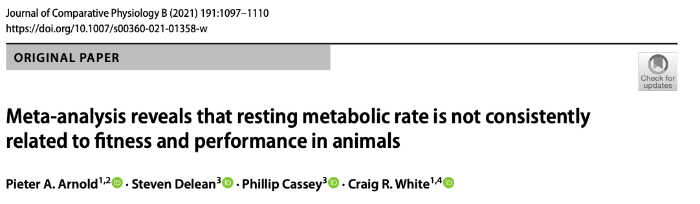

```{r setup, include=FALSE}
knitr::opts_chunk$set(echo = TRUE, cache = FALSE, tidy = TRUE)
options(digits=3)
```

```{r klippy, echo=FALSE, include=TRUE, message=FALSE, warning=FALSE}
#install.packages("devtools")
remotes::install_github("rlesur/klippy")
klippy::klippy(tooltip_message = 'Click to Copy Code', tooltip_success = 'Done', position = 'right', color = "red")

# Load packages
pacman::p_load(metafor, flextable, tidyverse, orchaRd, pander, mathjaxr, equatags, vembedr, magick)

```

## **Introduction to Publication Bias in Meta-analysis**

Meta-analyst's have worked hard to develop tools that can be used to try and understand different forms of publication practices and biases within the scientific literature. Such biases can occur if studies reporting non-significant or opposite results to what is predicted are not found in systematic searches ['i.e., the 'file-drawer' problem; @Jennions2013]. Alternatively, biases could result from selective reporting or 'p-hacking'. 

Visual and quantitative tools have been developed try and identify and 'correct' for such biases on meta-analytic results [@Jennions2013; @Nakagawa2021b; @Rothstein2005]. Having said that, aside from working hard to try and incorporate 'gray literature' (unpublished theses, government reports, etc.) and working hard to include work done in non-English speaking languages, there is little one can truly due to counteract publication biases beyond a few simple tools. We cannot know for certain what isn't published in many cases or how a sample of existing work on a topic might be biased. Nonetheless, exploring the possibility of publication bias and its possible effects on conclusions is a core component of meta-analysis [@ODea2021]. 

In this tutorial, we'll overview some ways we can attempt to understand whether publication bias is present or not using visual tools. In the next tutorial, we will cover some analytical approaches that might be used as a sensitivity analysis to explicitly test whether publication bias is present and attempt to to estimate how this changes the effect size if it didn't exist. Of course, often we will never know whether such biases exist and high heterogeneity can result in apparent publication bias when non exist. The goal here is to formally play a thought experiment: if publication bias were to exist what form would it be expected to take and how would our conclusions change if we were to have access to all available studies regardless of significance or power?

## **Visually Assessing Publication Bias**
### Introduction



We're going to have a look at a meta-analysis by @Arnold2021 that explores the relationship between resting metabolic rate and fitness in animals. Publication bias is slightly subtle in this particular meta-analysis, but it does appear to be present in some form both visually and analytically. We'll start off this tutorial just visually exploring for evidence of publication bias and dicuss what it might look like and why. 

### Download the Data

```{r rawdata, message=FALSE, warning=FALSE}
# Packages
pacman::p_load(tidyverse, metafor)

# Download the data. Exclude NA in r and sample size columns
arnold_data <- read.csv("https://raw.githubusercontent.com/pieterarnold/fitness-rmr-meta/main/MR_Fitness_Data_revised.csv")

# Exclude some NA's in sample size and r
arnold_data <- arnold_data[complete.cases(arnold_data$n.rep) & complete.cases(arnold_data$r),]

# Calculate the effect size, ZCOR
arnold_data <- metafor::escalc(measure = "ZCOR", ri = r, ni = n.rep, data = arnold_data, var.names = c("Zr", "Zr_v"))

# Lets subset to endotherms for demonstration purposes
arnold_data_endo <- arnold_data %>% 
               mutate(endos = ifelse(Class %in% c("Mammalia", "Aves"), "endo", "ecto")) %>% 
               filter(endos == "endo" & Zr <= 3) # Note that one sample that was an extreme outlier was removed in the paper.
```

### Funnel Asymmetry -- raw data

Funnel plots are by far the most common visual tool for assessing the possibility of publication bias [@Nakagawa2021b]. Just like any exploratory analysis, these are just visual tools. Let's have a look at a funnel plot of the data. Funnel plots plot the the effect size (x-axis) against some form of sampling variance or precision (y-axis). 

If no publication bias exists then we would expect the plot to look fairly symmetrical and funnel shaped (hence why it's called a funnel plot!). The reason why the shape is a funnel is because the sampling variance is expected to decrease (or the precision increase) when the sample size, and thus power, increases. These 'high-powered' studies are at the top of the 'funnel' in the narrow-necked region, so to say. In contrast, as the power of studies decrease, and therefore their sampling variance increase, we expect the spread of effect sizes to also increase simply because the process of sampling when we have small sample sizes results in greater variability of effects and effects that are large in magnitude by chance alone. 

```{r funnel, echo=TRUE, fig.align='center', fig.cap= "Funnel plot depicting the correlation between metabolism and fitness as a function of precision (1 / SE). The dotted lines are the theoretical 95% sampling variance intervals - the interval with which we expect effect size estimates to fall within if only sampling variance drives differences in effects." }

# Lets make a funnel plot to visualize the data in relation to the precision, inverse sampling standard error, 
metafor::funnel(x = arnold_data_endo$Zr, vi = arnold_data_endo$Zr_v, yaxis = "seinv", digits = 2, las = 1, xlab = "Correlation Coefficient (r)", atransf=tanh)
```

We can see from Fig. \@ref(fig:funnel) above the typical funnel shape. You will notice that most effects lie in the positive correlation space -- in other words there is a strong positive correlation between BMR and fitness. However, we also find some studies that show the opposite pattern. We expect that based on sampling theory alone, and indeed many of these effects fall close to the dotted sampling error intervals.

**But, what do we expect if publication bias were present?** Well, we expect under a file-drawer situation (i.e., where researchers stash away poorer quality studies showing opposite effects in their desk drawers) that studies with low power (i.e., low precision, wide standard errors, and small sample sizes) will go unpublished. This should be particularly true for studies that show the opposite to what we might predict by theory -- specifically, negative correlations from studies with small sample sizes / low precision. This is one factor that can drive what we call funnel asymmetry, showing a bunch of missing effect sizes in the bottom left corner of the funnel. 

If we look at Fig. \@ref(fig:funnel) we do see some hint of this scenario. There is a noticeable blank space in the bottom left corner with negative correlations  based on very small sample sizes that are generally small to moderate in magnitude going unpublished. But, interestingly, we also see that if the magnitude of correlation is large enough in the negative direction even with small sample sizes these can get published. We can only speculate as to why or if this is even a real signature of publication bias. However, this might suggest that if folks estimate large enough correlations and these are in the opposite direction to what one might expect these arguably 'surprising' results are more likely to be published than if the correlation is weak and in the opposite direction. 

### Funnel Asymmetry -- residuals
## **References**

<div id="refs"></div>
<br> 

## **Session Information**

```{r sessioninfo, echo = FALSE}
pander(sessionInfo(), locale = FALSE)
```

## [Back to Table of Contents](https://daniel1noble.github.io/meta-workshop/) {.hide}

<div class="tocify-extend-page" data-unique="tocify-extend-page" style="height: 0;"></div>
